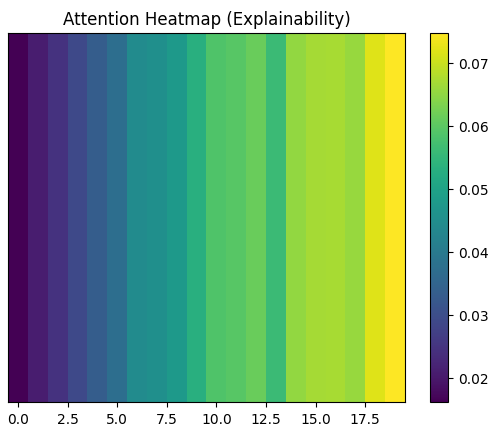

**GlucoNet-MM: A multimodal attention-based multi-task learning framework with decision transformer for personalised and explainable blood glucose forecasting (2025).**

# Mini GlucoNet-MM Prototype  
### Multimodal Attention-Based Blood Glucose Forecasting

---

## Objective

The goal of this prototype is to **practically explore multimodal and explainable deep learning methods** for short-term blood glucose prediction in diabetes care.

---

## What This Prototype Demonstrates

- Multimodal healthcare time-series learning  
  - CGM glucose  
  - insulin dosage  
  - carbohydrate intake  

- Attention-based temporal deep learning (GRU + attention)

- Short-term glucose prediction capability

- Basic explainability through **attention heatmap visualization**

---

## Method Overview

1. Multimodal physiological signals are normalized and converted into time-series sequences.  
2. A **GRU encoder** captures temporal glucose dynamics.  
3. An **attention mechanism** highlights important time steps.  
4. The model predicts **future glucose levels**.  
5. Attention weights provide **simple interpretability**.

---

## Results Shown in Notebook

- Training loss curve  
- Predicted vs. real glucose comparison  
- Attention heatmap for explainability  

These outputs demonstrate the **practical feasibility of interpretable multimodal glucose forecasting**.

---

## Learning Outcomes

Through this prototype, I learned:

- How to design **multimodal healthcare ML pipelines**  
- Implementation of **attention-based temporal models**  
- Importance of **interpretability in clinical AI systems**  
- Practical alignment with **personalized glucose prediction research**

---

## Future Work

- Use real clinical datasets (OhioT1DM / BrisT1D)  
- Add **multi-horizon prediction** (multi-task learning)  
- Integrate **decision-transformer-style policy conditioning**  
- Improve **uncertainty estimation and explainability**

---

## Author

**Sajjad Ahmad**  
BS Computer Science  
Research Interest: Multimodal AI, Explainable Healthcare ML, LLM-driven Clinical Decision Support
